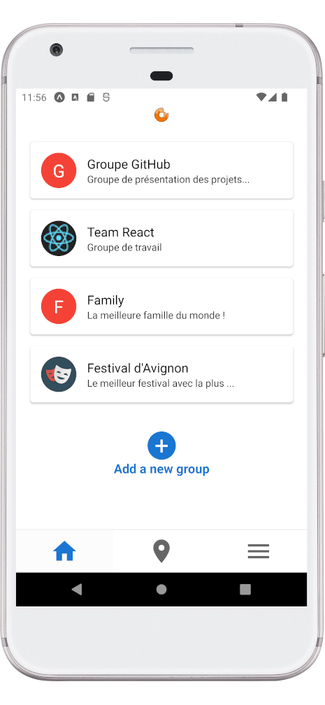
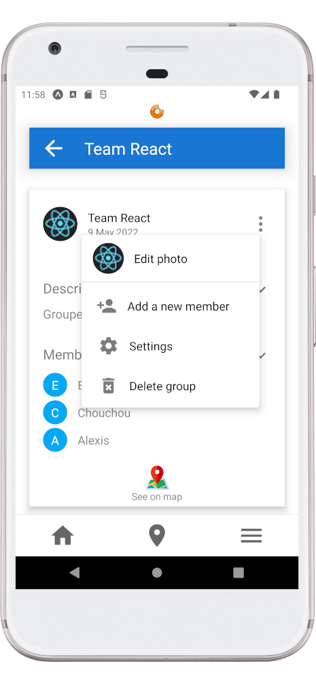
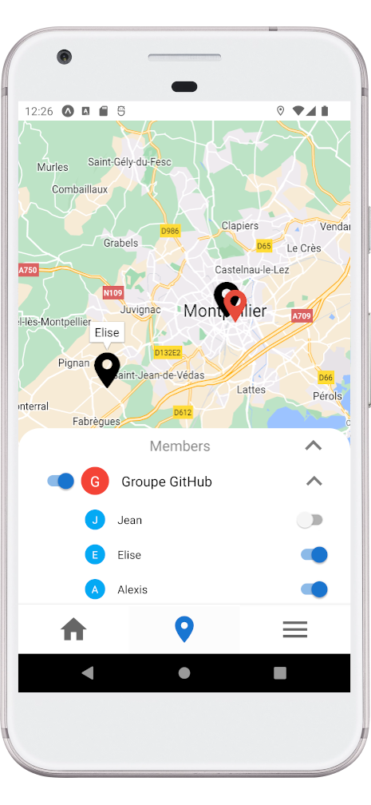
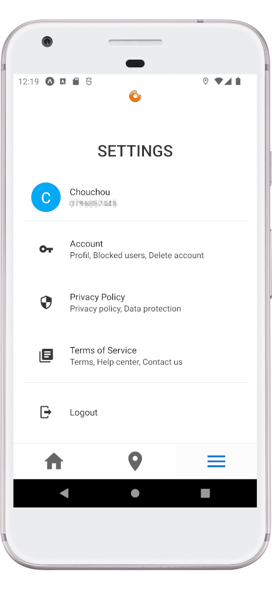
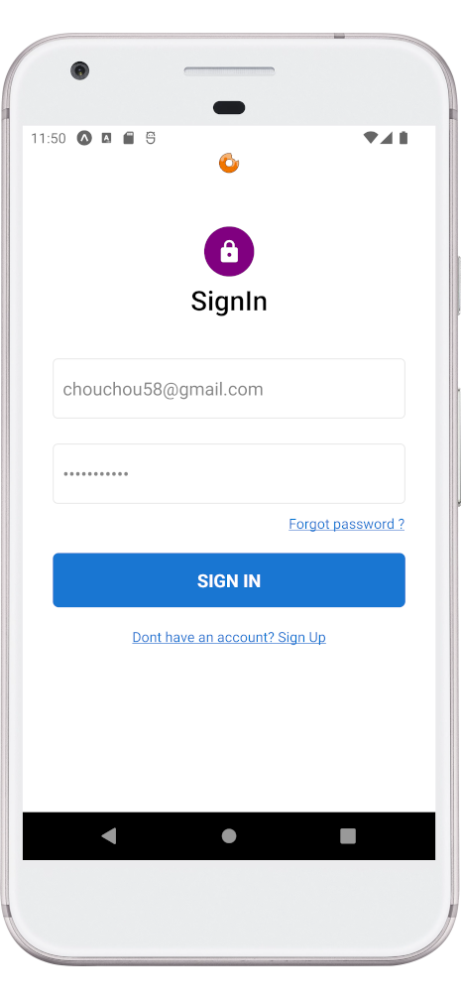
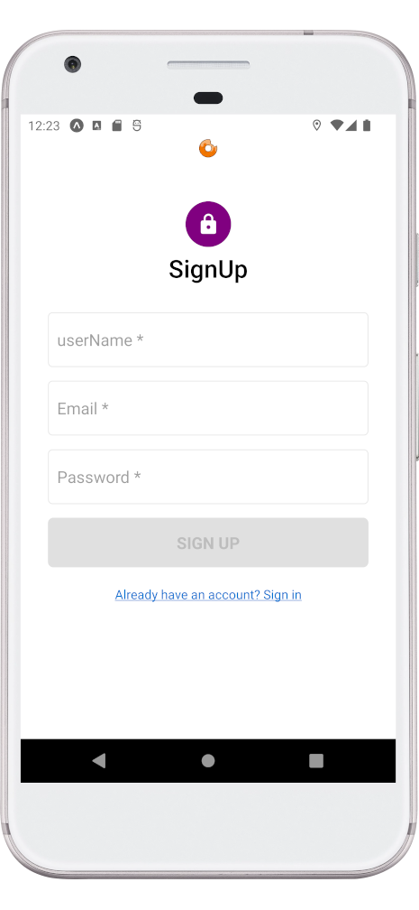

# Find-Us (Share your location with your group) - React Native

---

Une application qui permet de partager sa position GPS au sein d'un groupe (Whatsapp like).

 

 
 

(Photos importées d'Android Studio)

---

## Objectives :

---

L'idée était de migrer le prototype realisé sur React vers React Native. C'est aussi ma première réalisation avec ce framework.

Le projet complet comprend un partie back (accessible dans le projet React) et une partie front (ce projet).

L'application est un mixte entre un réseau social et un tracker GPS. Elle permet de : 

- Créer un groupe (ami, famille, travail) afin de partager sa position GPS en temps réel avec l'ensemble des membres.
- Afficher la position GPS des membres d'un groupe avec la possibilité de filtrer par membre.
- Et plein d'autres choses... 

## Technologies used :

---

Voici les technos principalement utilisées :

- Front : React Native et Redux Toolkit
